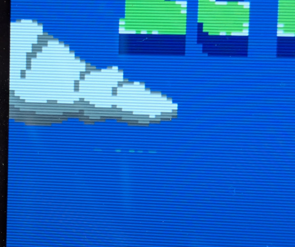

# C64 ASSY 250407 SRAM Adapter

## DISCLAIMER

Any use of this project is **under your own responsibility**.
You will be responsible of checking the correct construction and functionality of your board.
By using this project You will agree that I cannot be held responsible if it will destroy any of your devices, damage your computer, burn down your house or whatever.

**WARNING**: This is compatible with the 250407 board only!!!

## Introduction

This board implements a static RAM replacement for the DRAMs on a C64 with a 250407 motherboard.
I wanted to both reduce power consumption, and get a fix for the [VSP bug](https://www.pouet.net/prod.php?which=61024#c637759).

You will have to socket your DRAM ICs to install this board.

### Ordering the boards

You can order the board for this project at [PCBWay](https://www.pcbway.com/project/shareproject/C64_250407_SRAM_Adapter_9502264b.html) and support me or download 
the gerbers and have them printed wherever you like!!!

## Features

- You can choose to use SMD or DIP components for the logic and memory ICs
- Once the DRAMs are socketed, the board is easy to plug in and remove
- If your C64 lacks C203, a capacitor can be fitted on this board without having to further modify your motherboard

## Hardware

The board was designed with [KiCad](https://kicad.org/) EDA.

### Bill of Materials

| Component              | Qty | Type / Value                     | Notes                                                                |
| ---------------------- | --- | -------------------------------- | -------------------------------------------------------------------- |
| C1, C2, C3             |  3  | 100nF ceramic cap, SMD 1206      | Decoupling caps, rated at least 10V.                                 |
| C5                     |  1  | ~82-820pF ceramic cap, THT 2.5mm | Optional, install either this or C4 if C203 on mobo is missing       |
| C4                     |  1  | ~82-820pF ceramic cap, SMD 1206  | Optional, install either this or C5 if C203 on mobo is missing       |
| U1                     |  1  | 74HCT32, DIP14 or SO14           | Can be replaced with an ACT/ALS/LS/F. Do NOT use an HC.              |
| U2                     |  1  | 74HCT573, DIP 20 or TSSOP20      | Can be replaced with an ACT/ALS/LS/F. Do NOT use an HC.              |
| U3                     |  1  | 128Kx8 SRAM, DIP32 or SOP32      | I tested ICs between 75ns to 100ns without issue. 628128 pinout.     |
| Headers                |  1  | 40p 2.54mm machined header strip | Cut it into 4x8p, 1x2p and 5x1p pieces, then solder on the underside |

C4/C5 adjust `/CAS` timing to make the board play nice in C64s that do not have C203 fitted.

Value of C5/C4 is non critical, I had good luck with 300pF and 100pF caps. Note that I could also make do without the cap entirely
by replacing U1 (the '32 gate) with a schottky based one, so LS/ALS/F family.

### Fixes

#### Rev. 1

Rev. 1 lacks the space to solder C4/C5, you can just bodge a cap on the first two pins (`GND` and `/CAS`) of the bottom right header.

### Known Issues

I could not detect stability issues, the only problem I found is a graphical glitch on the title screen of ZetaWing 2,
where a single lines of pixels is flickering.

Note that this same issue **happens with other SRAM mods** (meant for shortboards) bodged to work on this machine, and disappears when using real DRAM ICs.

This seems a quirk of my VIC-II, a 6569R3. I modified the motherboard to support an 8565 and the issue disappeared (tested with an 8565R2).
